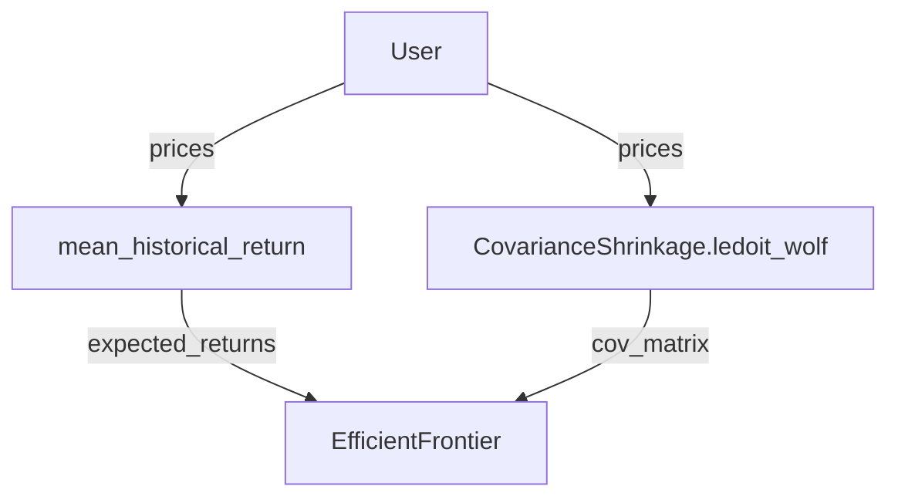

# Optimization

Portfolio optimization capabilities is the process of selecting the optimal mix of assets in a portfolio, with respect to the alpha scores, in order to maximize returns while minimizing risk. The `portfolio()` method has been implemented to streamline the process of optimization and facilitate the integration of backtesting.

The `portfolio()` calls the `PortfolioConstruction` class, which includes the implementation of the `optimize()` built-in public methods for optimization procedures, which integrates vectorbt pro **PyPortfolioOpt** wrapper.

## Integration

> PyPortfolioOpt is a library that implements portfolio optimization methods, including classical efficient frontier techniques and Black-Litterman allocation, as well as more recent developments in the field like shrinkage and Hierarchical Risk Parity, along with some novel experimental features, like exponentially-weighted covariance matrices. 

PyPortfolioOpt implements a range of optimization methods that are very easy to use. The optimization procedure consists of several distinct steps (some of them may be skipped depending on the optimizer):

* Calculate the expected returns (mostly located in `pypfopt.expected_returns`)
* Calculate the covariance matrix (mostly located in `pypfopt.risk_models`)
* Initialize and set up an optimizer (mostly located in `pypfopt.efficient_frontier`, with the base class located in `pypfopt.base_optimizer) including objectives, constraints, and target
* Run the optimizer to get the weights
* Convert the weights into a discrete allocation (optional)

For example, let's perform the mean-variance optimization (MVO) for maximum Sharpe:

```python
from pypfopt.expected_returns import mean_historical_return
from pypfopt.risk_models import CovarianceShrinkage
from pypfopt.efficient_frontier import EfficientFrontier

expected_returns = mean_historical_return(data)
cov_matrix = CovarianceShrinkage(data).ledoit_wolf()
optimizer = EfficientFrontier(expected_returns, cov_matrix)
weights = optimizer.max_sharpe()
```

### Parsing

The entire codebase of PyPortfolioOpt (with a few exceptions) has consistent argument and function namings, such that we can build a semantic web of functions acting as inputs to other functions. Therefore, the user just needs to provide the target function (e.g. `EfficientFrontier.max_sharpe`), and we can programmatically figure out the entire call stack having the pricing data alonw. If the user passes any additional keyword arguments, we can check which functions from the stack accept those arguments and automatically pass them.

For the example above, the web would be:



### Auto-optimization

Knowing how to parse and resolve function arguments, vectorbt implements a function `pypfopt_optimize`, which takes user requirements and translates them into function calls:

```python
vbt.pypfopt_optimize(prices=data.get("Close"))
```

In short, `pypfopt_optimize` triggers a waterfall of argument resolutions by parsing arguments, including the calculation of the expected returns and the risk model quantifying asset risk. Then, it adds objectives and constraints to the optimizer instance. Finally, it calls the target metric method (such as `max_sharpe`) or custom convex/non-convex objective using the same parsing procedure as we did above. If wanted, it can also translate continuous weights into discrete ones using `pypfopt.DiscreteAllocation`.

Since multiple PyPortfolioOpt functions can require the same argument that has to be pre-computed yet, pypfopt_optimize deploys a built-in caching mechanism. Below, we will demonstrate various optimizations done both using PyPortfolioOpt and vectorbt:

Optimizing a long/short portfolio to minimise total variance:

=== "pypfopt"
    ```python
    S = CovarianceShrinkage(data.get("Close")).ledoit_wolf()
    ef = EfficientFrontier(None, S, weight_bounds=(-1, 1))
    ef.min_volatility()
    weights = ef.clean_weights()

    ```

    ```
=== "opendesk"
    ```python
    strategy.portfolio(data.get("Close")).optimize(  
        expected_returns=None,
        weight_bounds=(-1, 1),
        target="min_volatility"
    )
    ```

Optimizing a portfolio to maximise the Sharpe ratio, subject to sector constraints. In opendesk, while the sector constraints is also an option, we can set the `alpha_block_constraints` to True, which constraints the portfolio depending on pre-modeled alpha blocks exposures:

=== "pypfopt"
    ```python
    from pypfopt.expected_returns import capm_return

    mu = capm_return(data.get("Close"))
    S = CovarianceShrinkage(data.get("Close")).ledoit_wolf()
    ef = EfficientFrontier(mu, S)
    ef.add_sector_constraints(sector_mapper, sector_lower, sector_upper)
    ef.max_sharpe()
    weights = ef.clean_weights()
    weights
    ```

=== "opendesk"
    ```python
    strategy.portfolio(data.get("Close")).optimize(  
        expected_returns="capm_return",
        alpha_block_constraints=True
    )
    ```

Optimizing a portfolio to maximise return for a given risk, subject to sector constraints, with an L2 regularisation objective:

=== "pypfopt"
    ```python
    from pypfopt.objective_functions import L2_reg

    mu = capm_return(data.get("Close"))
    S = CovarianceShrinkage(data.get("Close")).ledoit_wolf()
    ef = EfficientFrontier(mu, S)
    ef.add_sector_constraints(sector_mapper, sector_lower, sector_upper)
    ef.add_objective(L2_reg, gamma=0.1)
    ef.efficient_risk(0.15)
    weights = ef.clean_weights()
    ```

=== "opendesk"
    ```python
    strategy.portfolio(data.get("Close")).optimize(  
        expected_returns="capm_return",
        sector_mapper=sector_mapper,
        sector_lower=sector_lower,
        sector_upper=sector_upper,
        objectives=["L2_reg"],  
        gamma=0.1,  
        target="efficient_risk",
        target_volatility=0.15  
    )
    ```

Optimizing along the mean-semivariance frontier:

=== "pypfopt"
    ```python
    from pypfopt import EfficientSemivariance
    from pypfopt.expected_returns import returns_from_prices

    mu = capm_return(data.get("Close"))
    returns = returns_from_prices(data.get("Close"))
    returns = returns.dropna()
    es = EfficientSemivariance(mu, returns)
    es.efficient_return(0.01)
    weights = es.clean_weights()
    ```

=== "opendesk"
    ```python
    strategy.portfolio(data.get("Close")).optimize(  
        expected_returns="capm_return",
        optimizer="efficient_semivariance",  
        target="efficient_return",
        target_return=0.01
    )
    ```

Minimizing transaction costs:

```python
initial_weights = np.array([1 / len(data.symbols)] * len(data.symbols))
```
=== "pypfopt"
    ```python
    from pypfopt.objective_functions import transaction_cost

    mu = mean_historical_return(data.get("Close"))
    S = CovarianceShrinkage(data.get("Close")).ledoit_wolf()
    ef = EfficientFrontier(mu, S)
    ef.add_objective(transaction_cost, w_prev=initial_weights, k=0.001)
    ef.add_objective(L2_reg, gamma=0.05)
    ef.min_volatility()
    weights = ef.clean_weights()
    ```

=== "opendesk"
    ```python
    strategy.portfolio(data.get("Close")).optimize(  
        objectives=["transaction_cost", "L2_reg"],
        w_prev=initial_weights, 
        k=0.001,
        gamma=0.05,
        target="min_volatility"
    )
    ```

Custom convex objective:

```python
import cvxpy as cp

def logarithmic_barrier_objective(w, cov_matrix, k=0.1):
    log_sum = cp.sum(cp.log(w))
    var = cp.quad_form(w, cov_matrix)
    return var - k * log_sum
```

=== "pypfopt"
    ```python
    mu = mean_historical_return(data.get("Close"))
    S = CovarianceShrinkage(data.get("Close")).ledoit_wolf()
    ef = EfficientFrontier(mu, S, weight_bounds=(0.01, 0.3))
    ef.convex_objective(logarithmic_barrier_objective, cov_matrix=S, k=0.001)
    weights = ef.clean_weights()
    ```

=== "opendesk"
    ```python
    strategy.portfolio(data.get("Close")).optimize(  
        weight_bounds=(0.01, 0.3),
        k=0.001,
        target=logarithmic_barrier_objective  
    )
    ```

Custom non-convex objective:

```python
def deviation_risk_parity(w, cov_matrix):
    cov_matrix = np.asarray(cov_matrix)
    n = cov_matrix.shape[0]
    rp = (w * (cov_matrix @ w)) / cp.quad_form(w, cov_matrix)
    return cp.sum_squares(rp - 1 / n).value
```

=== "pypfopt"
    ```python
    mu = mean_historical_return(data.get("Close"))
    S = CovarianceShrinkage(data.get("Close")).ledoit_wolf()
    ef = EfficientFrontier(mu, S)
    ef.nonconvex_objective(deviation_risk_parity, ef.cov_matrix)
    weights = ef.clean_weights()
    ```

=== "opendesk"
    ```python
    strategy.portfolio(data.get("Close")).optimize(  
        target=deviation_risk_parity,  
        target_is_convex=False
    )
    ```

Black-Litterman Allocation, where `viewdict` is integrated within alpha blocks methods, where views are extracted from the median of weight range and magnitude calculated by multiplying the annualized volatility times $1.96$ (95% of the area under a normal curve lies within approximately 1.96 standard deviations of the mean):

```python
sp500_data = vbt.YFData.fetch(
    "^GSPC", 
    start=data.wrapper.index[0], 
    end=data.wrapper.index[-1]
)
# example given in vectorbt
market_caps = data.get("Close") * data.get("Volume")
viewdict = {
    "ADAUSDT": 0.20, 
    "BNBUSDT": -0.30, 
    "BTCUSDT": 0, 
    "ETHUSDT": -0.2, 
    "XRPUSDT": 0.15
}
```

=== "pypfopt"
    ```python
    from pypfopt.black_litterman import (
        market_implied_risk_aversion,
        market_implied_prior_returns,
        BlackLittermanModel
    )

    S = CovarianceShrinkage(data.get("Close")).ledoit_wolf()
    delta = market_implied_risk_aversion(sp500_data.get("Close"))
    prior = market_implied_prior_returns(market_caps.iloc[-1], delta, S)
    bl = BlackLittermanModel(S, pi=prior, absolute_views=viewdict)
    rets = bl.bl_returns()
    ef = EfficientFrontier(rets, S)
    ef.min_volatility()
    weights = ef.clean_weights()
    ```

=== "opendesk"
    ```python
    strategy.portfolio(data.get("Close")).optimize(  
        expected_returns="bl_returns",  
        market_prices=sp500_data.get("Close"),
        market_caps=market_caps.iloc[-1],
        absolute_views='alpha_blocks',
        target="min_volatility"
    )
    ```

Hierarchical Risk Parity:

=== "pypfopt"
    ```python
    from pypfopt import HRPOpt

    rets = returns_from_prices(data.get("Close"))
    hrp = HRPOpt(rets)
    hrp.optimize()
    weights = hrp.clean_weights()
    ```

=== "opendesk"
    ```python
    strategy.portfolio(data.get("Close")).optimize(  
        optimizer="hrp",
        target="optimize"
    )
    ```

### Argument groups

In cases where two functions require an argument with the same name but you want to pass different values to them, pass the argument as an instance of `pfopt_func_dict` where keys should be functions or their names, and values should be different argument values:

```python
vbt.pypfopt_optimize(  
    prices=data.get("Close"),
    expected_returns="bl_returns",  
    market_prices=sp500_data.get("Close"),
    market_caps=market_caps.iloc[-1],
    absolute_views=viewdict,
    target="min_volatility",
    cov_matrix=vbt.pfopt_func_dict({
        "EfficientFrontier": "sample_cov",  
        "_def": "ledoit_wolf"  
    })
)
```

## optimize

```python
Portfolio.optimize(
    target: Optional[Union[Callable, str]] = None,
    target_is_convex: Optional[bool] = None,
    weights_sum_to_one: Optional[bool] = None,
    target_constraints: Optional[List[Any]] = None,
    target_solver: Optional[str] = None,
    target_initial_guess: Optional[np.array] = None,
    objectives: Optional[List[Union[Callable, str]]] = None,
    constraints: Optional[List[Callable]] = None,
    alpha_block_constraints: Optional[bool] = True,
    sector_mapper: Optional[dict] = None,
    sector_lower: Optional[dict] = None,
    sector_upper: Optional[dict] = None,
    discrete_allocation: Optional[bool] = None,
    allocation_method: Optional[str] = None,
    silence_warnings: Optional[bool] = None,
    ignore_opt_errors: Optional[bool] = None,
    **kwargs
) -> OrderedDict:
```

Base optimizer model, allowing for the efficient computation of optimized asset weights. The portfolio method houses different optimization methods from PyPortfolioOpt, which generate optimal portfolios for various possible objective functions and parameters.

!!! warning "New Object Instantiation"
    A new object should be instantiated if you want to make any change to objectives/constraints/bounds/parameters.

### Parameters

``` markdown title="target"
Optional[Union[Callable, str]] = "max_sharpe"
```
<div class="result" markdown>

* `min_volatility`: Optimizes for minimum volatility
* `min_semivariance`: Minimises the portfolio semi-variance (downside deviation)
* `max_sharpe()`: Optimizes for maximal Sharpe ratio (a.k.a the tangency portfolio)
* `max_quadratic_utility`: Maximises the quadratic utility, given some risk aversion
* `efficient_risk`: Maximises return for a given target risk
* `efficient_return`: Minimises risk for a given target return
* `min_cvar`: Minimises the CVaR
* `min_cdar`: Minimises the CDaR

!!! example "Custom Objectives: The Kelly Criterion"

    ```python
    def kelly_objective(w, e_returns, cov_matrix, k=3): # (1)
        variance = np.dot(w.T, np.dot(cov_matrix, w))
        objective = variance * 0.5 * k - np.dot(w, e_returns)
        return objective

    weights = strategy.portfolio(prices).optimize(target=kelly_objective)
    ```

    1.  In probability theory, the Kelly criterion is a formula that determines the optimal theoretical size for a bet. It is valid when the expected returns are known. The Kelly bet size is found by maximizing the expected value of the logarithm of wealth, which is equivalent to maximizing the expected geometric growth rate, J. L. Kelly Jr [1956]. The criterion is also known as the scientific gambling method, as it leads to higher wealth compared to any other strategy in the long run (i.e. the theoretical maximum return as the number of bets goes to infinity).
</div>

``` markdown title="target_is_convex"
Optional[bool] = None
```
<div class="result" markdown>
If `target_is_convex` is True, the function is added as a convex function. Otherwise, the function is added as a non-convex function.
</div>

``` markdown title="weights_sum_to_one"
Optional[bool] = None
```
<div class="result" markdown>
Convex objective. Forces the sum of weight equals 1.
</div>

``` markdown title="target_constraints"
Optional[List[Any]] = None
```
<div class="result" markdown>

</div>

``` markdown title="target_solver"
 Optional[str] = None
```
<div class="result" markdown>

</div>

``` markdown title="target_initial_guess"
Optional[np.array] = None
```
<div class="result" markdown>

</div>

``` markdown title="objectives"
Optional[List[Union[Callable, str]]] = None
```
<div class="result" markdown>
List of lambda functions to add new term into the based objective function. This term must be convex, and built from cvxpy atomic functions.

Built-in objective functions wrapper includes:

* `L2_reg`: L2 regularisation, i.e $\gamma ||w||^2$, to increase the number of nonzero weights. Mean-variance optimization often results in many weights being negligible, i.e the efficient portfolio does not end up including most of the assets. This is expected behaviour, but it may be undesirable if you need a certain number of assets in your portfolio. In order to coerce the mean-variance optimizer to produce more non-negligible weights, we add what can be thought of as a “small weights penalty” to all of the objective functions, parameterised by $\gamma$ (gamma). This term reduces the number of negligible weights, because it has a minimum value when all weights are equally distributed, and maximum value in the limiting case where the entire portfolio is allocated to one asset. We refer to it as L2 regularisation because it has exactly the same form as the L2 regularisation term in machine learning, though a slightly different purpose (in ML it is used to keep weights small while here it is used to make them larger).

* `ex_ante_tracking_error`: Calculate the (square of) the ex-ante Tracking Error, i.e $(w - w_b)^T \Sigma (w-w_b)$
* `ex_post_tracking_error`: Calculate the (square of) the ex-post Tracking Error, i.e $Var(r - r_b)$
* `portfolio_return`: Calculate the (negative) mean return of a portfolio
* `portfolio_variance`: Calculate the total portfolio variance (i.e square volatility)
* `quadratic_utility`: Quadratic utility function, i.e $\mu - \frac 1 2 \delta  w^T \Sigma w$
* `sharpe_ratio`: Calculate the (negative) Sharpe ratio of a portfolio
* `transaction_cost`: A very simple transaction cost model: sum all the weight changes and multiply by a given fraction (default to 10bps). This simulates a fixed percentage commission from your broker.
</div>

``` markdown title="gamma"
Optional[float] = 1
```
<div class="result" markdown>
L2 regularisation parameter, defaults to 1. Increase if you want more non-negligible weights. In practice, $\gamma$ must be tuned to achieve the level of regularisation that you want. However, if the universe of assets is small (less than 20 assets), then gamma=1 is a good starting point. For larger universes, or if you want more non-negligible weights in the final portfolio, increase gamma.
</div>

``` markdown title="k"
Optional[float] = 0.001
```
<div class="result" markdown>
When transaction cost objective is set, fractional cost per unit weight exchanged.
</div>

``` markdown title="constraints"
Optional[List[Callable]] = None
```
<div class="result" markdown>
 List of lambda function (e.i. all assets <= 3% of the total portfolio = [lambda w: w <= .03]. This constraint must satisfy DCP rules, i.e be either a linear equality constraint or convex inequality constraint.
</div>

``` markdown title="alpha_block_constraints"
Optional[bool] = True
```
<div class="result" markdown>
Alpha blocks core constraints. It adds constraints on the sum of weights of different groups of assets. Most commonly, these will be sector constraints. These constraints a particularly relevant when working with alpha blocks (top-down or bottom-up), as we aim to limit our exposure to paricular group of assets. Defaults to `True`.
</div>

``` markdown title="sector_mapper"
Optional[dict] = None
```
<div class="result" markdown>
Maps tickers to sectors. Equivalent to `Strategy.mapping_table`.
</div>

``` markdown title="sector_lower"
Optional[dict] = None
```
<div class="result" markdown>
Lower bounds for each sector. Equivalent to `Portfolio.lower_bound`.
</div>

``` markdown title="sector_upper"
Optional[dict] = None
```
<div class="result" markdown>
Upper bounds for each sector. Equivalent to `Portfolio.upper_bound`.
</div>

``` markdown title="discrete_allocation"
Optional[bool] = None
```
<div class="result" markdown>
The discrete_allocation module contains the `DiscreteAllocation` class, which offers multiple methods to generate a discrete portfolio allocation from continuous weights. If `discrete_allocation` is True, it calls `allocation_method` as an attribute of the allocation object.
</div>

``` markdown title="allocation_method"
Optional[str] = "lp_portfolio"
```
<div class="result" markdown>
Generate a discrete portfolio allocation from continuous weights.  Method are:

* `greedy_portfolio`: Uses a greedy algorithm
* `lp_portfolio`: Uses linear programming
</div>

``` markdown title="silence_warnings"
Optional[bool] = None
```
<div class="result" markdown>
Disable warnings. If set to False, it throws a warning stating that either the optimization fails or that an argument wasn't required by any function in the call stack. 
</div>

``` markdown title="ignore_opt_errors"
Optional[bool] = None
```
<div class="result" markdown>
Ignore any target optimization errors.
</div>

``` markdown title="optimizer"
Optional[str] = None
```
<div class="result" markdown>
Specify the optimizer. It can be an instance of `pypfopt.base_optimizer.BaseOptimizer`, an attribute of `pypfopt`, a subclass of `pypfopt.base_optimizer.BaseOptimizer`, or one of the following options:

* `efficient_frontier`: `pypfopt.efficient_frontier.EfficientFrontier`
* `efficient_cdar`: `pypfopt.efficient_frontier.EfficientCDaR`
* `efficient_cvar`: `pypfopt.efficient_frontier.EfficientCVaR`
* `efficient_semivariance`: `pypfopt.efficient_frontier.EfficientSemivariance`
* `black_litterman` or `bl`: `pypfopt.black_litterman.BlackLittermanModel`
* `hrp`: `pypfopt.hierarchical_portfolio.HRPOpt`
* `cla`: `pypfopt.cla.CLA`

!!! note "Black-litterman"
    > Black-Litterman model takes a Bayesian approach to asset allocation. Specifically, it combines a prior estimate of returns (for example, the market-implied returns) with views on certain assets, to produce a posterior estimate of expected returns. It will then meaningfully propagate views, taking into account the covariance with other assets. 
</div>

``` markdown title="absolute_views"
Optional[pandas.core.series.Series | Dict[str, float] | str] = None
```
<div class="result" markdown>
A colleciton of K absolute views on a subset of assets, defaults to None. If set to `alpha_blocks`, it computes the "alpha blocks views". The alpha blocks implementation works with the Black-Litterman absolute views, where views are extracted from the median of weight range and magnitude calculated by multiplying the annualized volatility times $1.96$. In probability and statistics, the 97.5th percentile point of the standard normal distribution is a number commonly used for statistical calculations. The approximate value of this number is 1.96, meaning that 95% of the area under a normal curve lies within approximately 1.96 standard deviations of the mean.
</div>

``` markdown title="pi"
Optional[pandas.core.series.Series | numpy.ndarray] = None
```
<div class="result" markdown>
Nx1 prior estimate of returns, defaults to None. If pi=”market”, calculate a market-implied prior (requires market_caps to be passed). If pi=”equal”, use an equal-weighted prior.
</div>

``` markdown title="omega"
Optional[pandas.core.frame.DataFrame | numpy.ndarray | string] = None
```
<div class="result" markdown>
KxK view uncertainty matrix (diagonal), defaults to None Can instead pass “idzorek” to use Idzorek’s method (requires you to pass view_confidences). If omega=”default” or None, we set the uncertainty proportional to the variance.
</div>

``` markdown title="view_confidences"
Optional[pandas.core.series.Series | numpy.ndarray | List] = None
```
<div class="result" markdown>
Kx1 vector of percentage view confidences (between 0 and 1), required to compute omega via Idzorek’s method.
</div>

``` markdown title="tau"
Optional[float] = 0.05
```
<div class="result" markdown>
the weight-on-views scalar (default is 0.05) risk_aversion (positive float, optional) – risk aversion parameter, defaults to 1.
</div>

``` markdown title="market_caps"
Optional[pandas.core.series.Series | numpy.ndarray] = None
```
<div class="result" markdown>
Market caps for the assets, required if pi=”market”
</div>

``` markdown title="risk_free_rate"
Optional[float] = 0.02
```
<div class="result" markdown>
Risk-free rate of borrowing/lending, defaults to 0.02. The period of the risk-free rate should correspond to the frequency of expected returns.
</div>

``` markdown title="expected_returns"
Optional[str] = "mean_historical_return"
```
<div class="result" markdown>
Specify the expected returns. `expected_returns` can be an array, an attribute of `pypfopt.expected_returns`, a function, or one of the following options:

* `mean_historical_return`: `pypfopt.expected_returns.mean_historical_return`
* `ema_historical_return`: `pypfopt.expected_returns.ema_historical_return`
* `capm_return`: `pypfopt.expected_returns.capm_return`
* `bl_returns`: `pypfopt.black_litterman.BlackLittermanModel.bl_returns`
</div>

``` markdown title="cov_matrix"
Optional[str] = "ledoit_wolf"
```
<div class="result" markdown>
Specify the covariance matrix. `cov_matrix` can be an array, an attribute of `pypfopt.risk_models`, a function, or one of the following options:

* `sample_cov`: pypfopt.risk_models.sample_cov
* `semicovariance` or `semivariance`: pypfopt.risk_models.semicovariance
* `exp_cov`: pypfopt.risk_models.exp_cov
* `ledoit_wolf`: `pypfopt.risk_models.CovarianceShrinkage.ledoit_wolf` with `constant_variance` as shrinkage factor
* `ledoit_wolf_single_factor`: `pypfopt.risk_models.CovarianceShrinkage.ledoit_wolf` with `single_factor` as shrinkage factor
* `ledoit_wolf_constant_correlation`: `pypfopt.risk_models.CovarianceShrinkage.ledoit_wolf` with `constant_correlation` as shrinkage factor
* `oracle_approximating`: `pypfopt.risk_models.CovarianceShrinkage.ledoit_wolf` with `oracle_approximating` as shrinkage factor
</div>

``` markdown title="weight_bounds"
Optional[Tuple[float, float]] = (-1, 1)
```
<div class="result" markdown>
Minimum and maximum weight of each asset or single min/max pair if all identical, defaults to (-1, 1). If `weight_bounds=(-1, 1)`, allows short positions.
</div>

```markdown title="target_return"
float
```
<div class="result" markdown>
The desired return of the resulting portfolio.
</div>

``` markdown title="market_neutral"
Optional[bool] = False
```
<div class="result" markdown>
whether the portfolio should be market neutral (weights sum to zero), defaults to False. Requires negative lower weight bound.
</div>

``` markdown title="target_volatility"
float
```
<div class="result" markdown>
The desired maximum volatility of the resulting portfolio.
</div>

``` markdown title="risk_aversion"
Optional[int] = 1
```
<div class="result" markdown>
Risk aversion parameter (must be greater than 0), defaults to 1.
</div>

``` markdown title="n_asset_constraints"
Optional[List[Type]] = None
```
<div class="result" markdown>
Number of assets in the portfolio constraints. Cardinality constraints are not convex, making them difficult to implement. However, we can treat it as a mixed-integer program and solve (provided you have access to a solver). for small problems with less than 1000 variables and constraints, you can use the community version of [CPLEX](https://en.wikipedia.org/wiki/CPLEX) available in python `pip install cplex`.

!!! warning "`n_asset_constraints`"
    This functionnality is still work in progress, as it requires external capabilities (`cplex`).
</div>


### Returns

`OrderedDict`, optimized weights.

## Example Optimizer

!!! example "Example Optimizer"

        Portfolio construction, which involves optimizing the allocation of assets within a portfolio, can be a complex and nuanced process. We have developed a method that allows for greater flexibility and experimentation in the portfolio optimization process. This approach enables the exploration of a wide range of potential portfolio compositions, and the example provided illustrates this method applied from the initial stages of portfolio construction:

        * A mapping table, `mapping_table`, has been defined to specify the group membership of each investable stocks
        * The base model is set `mvo`, the Mean-Variance Optimization from the [pypfopt library](https://pyportfolioopt.readthedocs.io/en/latest/MeanVariance.html), with the appropriate return and risk models
        * The weight bounds parameter, `weight_bounds` is set to `(-1, 1)`, which serves as the first constraint by limiting the minimum and maximum weight of each asset in portfolios that allow short positions
        * Additionally, new constraints are introduced to the optimization problem in the form of convex inequalities, which ensure that long positions do not exceed 10% and short positions do not fall below -10%

        ```py
        from opendesk import Strategy

        strategy = Strategy(
            steps=steps, 
            topdown=True,
            mapping_table=mapping_table # (3)
        )
        strategy.fit(sector_prices).estimate(sum) # (1)
        weights = strategy.portfolio(stock_prices).optimize( # (2)
            target="min_volatility"
            weight_bounds=(-1, 1) # (4)
            constraints=[
                lambda w: w <=  .1, 
                lambda w: w >= -.1
            ] # (5)
        )
        ```

        1.  pandas.DataFrame object, with specifiy the variation of sector returns over time.
        2.  pandas.DataFrame object, with specifiy the variation of stock prices over time.
        3.  Mapping table where stock ticker/id are keys and sector name are values.
        4. `weight_bounds` parameter serves as a constraint by limiting the minimum and maximum weight of each asset in portfolios. Because it ranges from `-1` to `1`, it allows Long and Shorts.
        5. Users can add new constraints in a form of lambda function as the user need to the optimization problem. This constraint must satisfy DCP rules, i.e be either a linear equality constraint or convex inequality constraint.