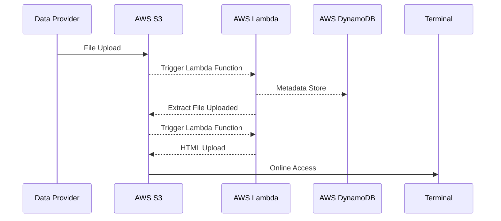

# Workflow

!!! info "What is AWS CloudFormation?"
    Documentation available on [What is AWS CloudFormation? - AWS CloudFormation](https://docs.aws.amazon.com/AWSCloudFormation/latest/UserGuide/Welcome.html)

AWS CloudFormation is a service that provides a model-based approach to provisioning and managing AWS resources. It allows you to create templates that define the resources you need, such as Amazon EC2 instances or Amazon RDS DB instances, and CloudFormation takes care of provisioning and configuring those resources automatically. This eliminates the need for manual resource creation and configuration, and also helps to manage the dependencies between resources. As a result, you can focus more on developing your applications that run on AWS, rather than spending time on resource management. The following scenarios illustrate how CloudFormation can be used to streamline the resource management process.