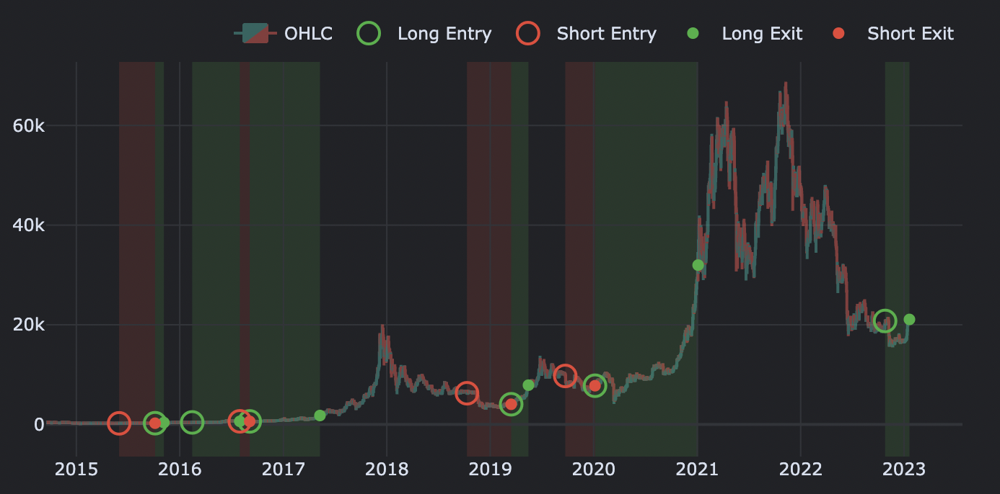

# Backtest Blocks

## Open-Source Resources

This platform aggregates a range of state-of-the-art tools and libraries and facilitates their automation through a unified interface. This allows users to easily access and utilize a wide range of advanced resources for their research or development efforts, streamlining the process of utilizing cutting-edge technologies.

There is a wide range of options available for Python when it comes to selecting a backtesting framework. A comprehensive list of these libraries can be found on the GitHub page titled [awesome-quant](https://github.com/wilsonfreitas/awesome-quant#trading--backtesting). We initially experimented with one called Backtesting and then subsequently tested a few others. For the purpose of backtesting, vectorbt can be considered as a suitable initial choice for integrating our model pipeline due to its fast performance and ease of use. It also actively managed and a more advance version has been created: [vectorbt **pro**](https://vectorbt.pro/).

## Integration

> vectorbt is a Python package for quantitative analysis that takes a novel approach to backtesting: it operates entirely on pandas and NumPy objects, and is accelerated by Numba to analyze any data at speed and scale. This allows for testing of many thousands of strategies in seconds.

Vectorbt is a powerful tool that combines the functionality of a fast backtester with advanced data analysis capabilities. It enables users to analyze and evaluate a wide range of trading options, instruments, and time periods with ease, enabling them to identify patterns and optimize their strategy. It allows users to explore and understand complex phenomena in trading data, providing them with valuable insights that can inform their decision-making and potentially give them an informational advantage in the market.

It utilizes a vectorized representation of trading strategies in order to optimize performance. This representation involves storing multiple strategy instances in a single multi-dimensional array, as opposed to the traditional object-oriented programming (OOP) approach of representing strategies as classes and data structures. The vectorized representation used by vectorbt allows for more efficient processing and comparison of strategies, and can particularly improve the speed of analysis when dealing with quadratic programming problems.

Numba is a just-in-time (JIT) compiler for Python that is designed to improve the performance of Python code. It does this by compiling Python code to native machine instructions, which can be executed much faster than the interpreted code that is normally used in Python. Numba works by decorating functions or methods with a special `@jit` decorator, which tells the Numba compiler to compile the function for faster execution. Numba can be used to speed up code that makes heavy use of Python's scientific and numerical libraries, such as NumPy and SciPy, as well as code that performs CPU-bound operations. In addition to its JIT compiler, Numba also provides support for parallel programming through its `@vectorize` and `@guvectorize` decorators, which can be used to parallelize the execution of certain types of functions.

## Step-by-Step Example

The `backtest` classmethod within the `Strategy` class utilizes the vectorbt library to test and evaluate the performance of a given strategy in the context of alpha blocks methodology.

In the field of software engineering, it is recommended that a function be designed in a manner that promotes testability by adhering to the principles of cohesion. Specifically, this entails limiting the function's scope to a single, well-defined task, as well as minimizing the number of arguments it accepts. 

In cases where a function is required to operate on multiple arguments, it is suggested to employ techniques such as encapsulation by utilizing higher-level objects to group the arguments together. This allows for more robust and maintainable codebase.

This is why we created `BacktestConfig`, a dataclass object, which encapsultes required arguments to create exposure and build portfolio at each rebalancing period.

### Step 1: BacktestConfig

The `backtest` method is initalized through the `BacktestConfig`, which facilitates feature integration. For example, variables `universe`, `model_data`, `steps`, `topdown` and `mapping_table` are set to match your requirement. All other variables are pre-set.

```python
from opendesk.backtest import BacktestConfig

config = BacktestConfig(
    steps=[(
        "my_block", 
        MyBlock, 
        {"mapping_score": mapping_score}, 
        {"price_earnings": price_earnings}
    )],     
    universe=stock_prices, 
    model_data=model_data, 
    topdown=True, 
    mapping_table=mapping_table,
    portfolio='optimize',
    backtest_backup="discrete_allocation"
)
```

The backtest implementation initializes, fits and estimates exposures using the `fit()` and the `estimate()` methods. Then, it optimizes the portfolio at the stock level using the `portfolio()` and `optimize()` methods and finds weights that align with the desired level of risk. 

The strategy is rebalanced on a monthly basis, and the `discrete_allocation()` method is used as a fallback in the event that the optimizer is unable to deliver feasible weights.

### Step 2: Backtest

The output is a `Portfolio` object, which allows users to leverage the entire **vectorbtpro** ecosystem.

```python
backtest = Strategy.backtest(config)
backtest.plot_trade_signals().show()
```
<figure markdown>
  
  <figcaption>Figure 1: Example Backtest</figcaption>
</figure>