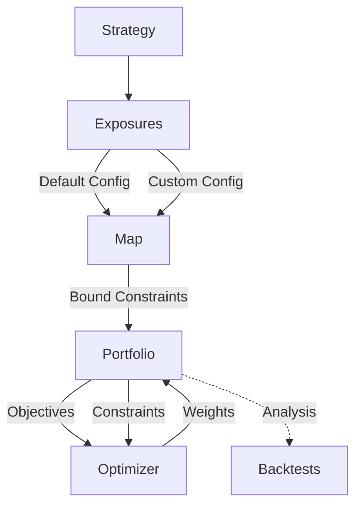
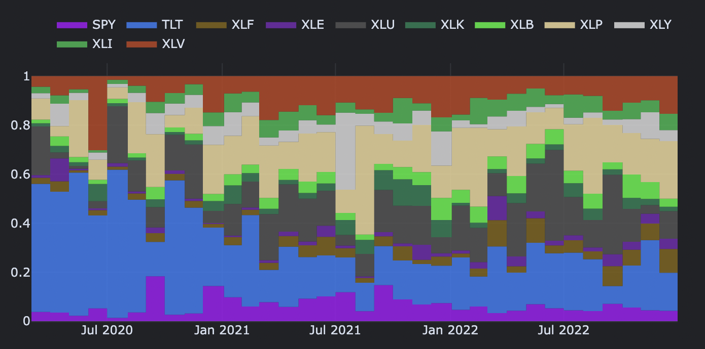

# Optimize Blocks

Portfolio optimization is the process of selecting the optimal mix of assets in a portfolio in order to maximize returns while minimizing risk. One method of portfolio optimization involves the use of alpha scores. By selecting assets with high alpha scores, an investor can potentially achieve higher probability of positive returns while taking on the same level of risk. The optimal portfolio is typically determined through the use of statistical analysis and optimization techniques, such as mean-variance or Black-Litterman optimization.

Portfolio optimization using alpha scores has been studied extensively in the financial literature. For example, in a study published in the Journal of Financial Economics[^1], Chen, Novy-Marx, and Zhang (2013) found that portfolios constructed using alpha scores significantly outperformed traditional market-cap weighted portfolios. Another study by Geczy, Musto, and Reed (2005) published in the Review of Financial Studies[^2] found that portfolios constructed using alpha scores had higher Sharpe ratios (a measure of risk-adjusted returns) compared to traditional portfolios.

!!! warning "Risk Considerations"
    It's important to note that while alpha scores can be useful for portfolio optimization, they are not a guarantee of success. Like any investment strategy, portfolio optimization using alpha scores carries its own set of risks and uncertainties. It is always important for investors to carefully consider their investment goals and risk tolerance before making any investment decisions.

There are several advanced techniques for portfolio optimization that take into account different factors such as risk, correlation between assets, liquidity, regulatory, tax or ethical constraints. Here are some of the most commonly used techniques:

* **Markowitz portfolio optimization**: This approach, proposed by Harry Markowitz in 1952, uses the efficient frontier theory to determine the optimal portfolio that offers the best expected return for a given level of risk
* **Conditional variance portfolio optimization**: This approach allows for changes in volatility and correlation between assets over time to adjust the portfolio accordingly
* **Multi-objective optimization**: This approach considers multiple objectives, such as return, risk, and liquidity, and finds a compromise between these objectives to obtain an optimal portfolio that meets multiple criteria.
* **Robust optimization**: This approach aims to find an optimal portfolio that is resistant to disturbances and uncertainties by considering different possible scenarios
* **AI-based portfolio optimization**: This approach uses machine learning algorithms to analyze historical financial market data and predict future trends, in order to construct an optimal portfolio that maximizes return while minimizing risk
  
These different portfolio optimization techniques all have their advantages and limitations, and their choice depends on the specific goals and constraints of each investor.

## Key Takeaways

An interval query is used to assign scores to elements in a portfolio. These scores are then used to determine the relative weightings of the highest and lowest elements in the portfolio. The resulting portfolio reflects these weightings and adheres to any specified objectives and constraints.



!!! question "Why Are We Not Creating Weights in the First Place?"

    There are a few reasons why you might calculate scores rather than directly assigning "weights" to potential assets in their investment portfolios. 
    
    One reason is that scores can be used to rank potential investments relative to one another, while weights are typically used to indicate the proportion of your total portfolio that should be allocated to a particular asset. This means that scores can be used to identify which assets are the most attractive candidates for inclusion in a portfolio, while weights are used to determine how much of an your capital should be allocated to each asset. 
    
    Another reason is that scores can be based on a variety of different factors and criteria, whereas weights are usually based on a single factor (e.g., expected return or risk). By using scores, you can take a more holistic view of potential investments and consider multiple factors when making decisions. 
    
    Furthermore, the allocation of weights in the portfolio would not consider the overall goals and limitations of the portfolio. It would only be based on the weights where alpha scores have been calculated, such as at the sector level.

## Methods

### Mean-Variance Optimisation

* `min_volatility` optimises for minimum volatility
* `max_sharpe` optimises for maximal Sharpe ratio (a.k.a the tangency portfolio)
* `max_quadratic_utility` maximises the quadratic utility, given some risk aversion
* `efficient_risk` maximises return for a given target risk
* `efficient_return` minimises risk for a given target return

### General Efficient Frontier

#### Efficient Semi-variance

* `min_semivarianc`e minimises the portfolio semi-variance (downside deviation)
* `max_quadratic_utility` maximises the "downside quadratic utility", given some risk aversion.
* `efficient_risk` maximises return for a given target semi-deviation
* `efficient_return` minimises semi-deviation for a given target return

#### Efficient CVaR

**The Conditional Value-at-Risk - Expected Shortfall**:

* `min_cvar` minimises the CVaR
* `efficient_risk` maximises return for a given CVaR
* `efficient_return` minimises CVaR for a given target return

#### Efficient CDaR

**Conditional Drawdown-at-Risk**:

* `min_cdar` minimises the CDaR
* `efficient_risk` maximises return for a given CDaR
* `efficient_return` minimises CDaR for a given target return

### Kelly criterion

In probability theory, the Kelly criterion is a formula that determines the optimal theoretical size for a bet. It is valid when the expected returns are known. The Kelly bet size is found by maximizing the expected value of the logarithm of wealth, which is equivalent to maximizing the expected geometric growth rate, J. L. Kelly Jr (1956). The criterion is also known as the scientific gambling method, as it leads to higher wealth compared to any other strategy in the long run (i.e. the theoretical maximum return as the number of bets goes to infinity).

### Hierarchical Risk Parity

Portfolio construction is perhaps the most recurrent financial problem. On a daily basis, investment managers must build portfolios that incorporate their views and forecasts on risks and returns. This is the primordial question that a 24 years old Harry Markowitz attempted to answer more than 6 decades ago. His monumental insight was to recognize that various levels of risk are associated with different optimal portfolios in terms of risk-adjusted returns, hence the notion of “efficient frontier” (Markowitz, 1952). One implication was that it is rarely optimal to allocate all assets to the investments with highest expected returns. Instead, we should take into account the correlations across alternative investments in order to build a diversified portfolio. 

A correlation matrix is a linear algebra object that measures the cosines of the angles between any two vectors in the vector space formed by the returns series (see Calkin and López de Prado [2014a, 2015b]). One reason for the instability of quadratic optimizers is that the vector space is modelled as a complete (fully connected) graph, where every node is a potential candidate to substitute another. In algorithmic terms, inverting the matrix means evaluating the partial correlations across the complete graph.

Hierarchical Risk Parity[^1] (HRP) is a novel portfolio optimization method. HPR  applies modern mathematics (graph theory and machine learning techniques) to build a diversified portfolio based on the information contained in the covariance matrix. However, unlike quadratic optimizers, HRP does not require the invertibility of the covariance matrix. In fact, HRP can compute a portfolio on an ill-degenerated or even a singular covariance matrix, an impossible feat for quadratic optimizers Monte Carlo experiments show that HRP delivers lower out-of-sample variance than CLA, even though minimum-variance is CLA’s optimization objective. HRP also produces less risky portfolios out-of-sample compared to traditional risk parity methods. The HRP method consists of several key steps:

1. From a universe of assets, form a distance matrix based on the correlation of the assets
2. Using this distance matrix, cluster the assets into a tree via hierarchical clustering
3. Within each branch of the tree, form the minimum variance portfolio (normally between just two assets)
4. Iterate over each level, optimally combining the mini-portfolios at each node

The advantages of this are that it does not require the inversion of the covariance matrix as with traditional mean-variance optimization, and seems to produce diverse portfolios that perform well out of sample.

### Black-Litterman allocation

!!! note "Black-Litterman Approach"
     This method is also particularly useful in the Black-Litterman (BL) model, which is a Bayesian approach to asset allocation. The BL model combines an initial estimate of returns with specific views on certain assets to generate a revised estimate of expected returns. This revised estimate, known as the posterior estimate, is then used to optimize the allocation of assets in accordance with a predetermined set of objectives (e.g., maximizing Sharpe ratio) and constraints.
     
The Black-Litterman (BL) model takes a Bayesian approach to asset allocation. Specifically, it combines a prior estimate of returns with views on certain assets, to produce a posterior estimate of expected returns. It then optimises weights following a set of objectives (e.g. maximising Sharpe) and constraints.
Effective portfolio construction is the ability to transfer investment skill efficiently into positions. 

#### From signals to returns: How to make signals into forecast views?

In the BL model, users can either provide absolute or relative views:

* Absolute views are statements: "asset 1 indicates a return of 10%" or "asset 2 indicates a drop of 40%"
* Relative views, on the other hand, are statements: "asset 2 indicates it will outperform asset 1 by 3%"

These views need to be provided to the model in the form of a return estimate. These estimates can be provided for either all or any subset of investables used by the model. The process of converting asset views to returns is necessary in order to be used in an optimiser.

#### Confidence

The BL formula simply represents a weighted average between the prior estimate of returns and the views, where the weighting is determined by the confidence in the views

* Confidence is extracted from factor scores themselves
* Factor scores range from -1 to 1, with a score of 0 being the average or neutral value
* In a long/short strategy, 1 would be the highest confidence from the long leg and -1 would also be the highest confidence from the short leg. The closer a score is to the mean, the smaller the confidence in that score

#### Black-Litterman Entropy Pooling

Additionaly, this extended version of the BL method is particularly useful when managing a top-down strategy. It consists of several key steps::

1. The Black-Litterman model is a mathematical framework for combining subjective views or forecasts with objective market data in order to generate improved portfolio weight estimates
2. The entropy pooling approach is a specific method within the Black-Litterman framework for combining multiple views, where each view is represented as a ranking of assets rather than as a specific weighting
3. In the entropy pooling approach, the subjective views are transformed into probability distributions over the set of assets, with the probability of each asset being proportional to its rank in the view
4. These probability distributions are then combined using a process called entropy pooling, which involves taking the weighted average of the individual probability distributions while minimizing the amount of uncertainty or "entropy" in the resulting combined distribution
5. The resulting combined probability distribution can then be used to generate improved portfolio weight estimates by solving a optimization problem that takes into account both the market data and the subjective views. The optimization problem can be formulated as a quadratic programming problem and solved using standard optimization techniques

[^1]: Marco Lopez de Prado, Building Diversified Portfolios that Outperform Out-of-Sample, Journal of Portfolio Management, 2016

## Step-by-Step Example

Portfolio construction, which involves optimizing the allocation of assets within a portfolio, can be a complex and nuanced process. We have developed a method that allows for greater flexibility and experimentation in the portfolio optimization process. This approach enables the exploration of a wide range of potential portfolio compositions, and the example provided illustrates this method applied from the initial stages of portfolio construction.

```py
from opendesk import Strategy
from opendesk.blocks import Reversion

strategy = Strategy([("reversion", Reversion)]).fit(df).estimate(sum) # (1)

```

1.  Calculate sentiment using Reversion Ranking Method.
    More information provided in the [Blocks](../blocks/en/index.md).

### Step 1: Portfolio

We aim to find weights for a large universe of stocks:

```python
strategy.portfolio(data=stock_prices) # (1)
```

1.  pandas.DataFrame object, with specifiy the variation of stock prices over time.

### Step 2: Optimize

The wrapper class inherite from `PortfolioConstruction`, which adds the `optimize` public method to your toolbox, allowing for the efficient computation of optimized asset weights. Constraints are lambda functions (e.i. all assets must be lower or equal to 10% of the total portfolio would simply translate to `[lambda w: w <= .1]`. This constraint must satisfy DCP rules, i.e be either a linear equality constraint or convex inequality constraint. Here is an example with "min_volatility", which finds the minimum risk portfolio:

```python
weights = strategy.optimize(  
    weight_bounds=(-1, 1), # (1)
    target="min_volatility",
    constraints=[lambda w: w <= .1]
)
```

1. `weight_bounds` parameter serves as a constraint by limiting the minimum and maximum weight of each asset in portfolios. Because it ranges from `-1` to `1`, it allows Long and Shorts.

<div class="termy">
  ```console
  $ pd.Series(weights, name="weights")
  <span style="color: grey;">asset 1      0.10
  asset 2      0.03
  asset 3     -0.02
  asset 4      0.03
  asset 5     -0.05

  asset 96     0.00
  asset 97    -0.09
  asset 98     0.00
  asset 99    -0.07
  asset 100    0.00
  Name: weights, Length: 100, dtype: float64
  </span>
  ```
</div>

<figure markdown>
  
  <figcaption>Figure 1: Example Weights</figcaption>
</figure>

[^1]: Chen, L., Novy-Marx, R., & Zhang, L. (2013). Factor Premia and Interaction with the Market Portfolio. Journal of Financial Economics, 110(1), 1-35.
[^2]: Geczy, C., Musto, D., & Reed, A. (2005). A simple approach to performance attribution for hedge funds: the case of equity market neutral strategies. Review of Financial Studies, 18(2), 367-384.
